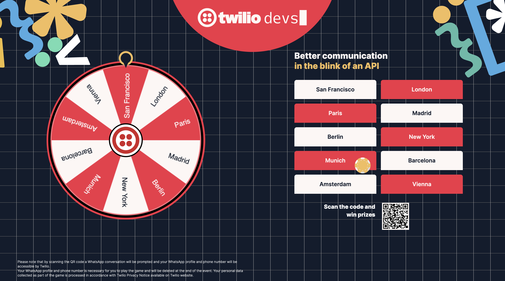

# Wheel Of Twilio Game

This project is Twilio's innovative booth activation designed to motivate people to engage with Twilio's technology while offering them the opportunity to win exciting prizes.



## Development Setup

### Prerequisites

- Ensure you have [pnpm](https://pnpm.io/) installed.
- A Twilio account. Sign up [here](https://www.twilio.com/try-twilio) if you don't have one.

### Getting Started

1. **Clone the project repository:**

   ```bash
   git clone https://github.com/your-repo/wheel-of-fortune.git
   cd wheel-of-fortune
   ```

2. **Set up Twilio Services:**

   - Go to the [Twilio Console](https://www.twilio.com/console).
   - Create the following services and save the service SIDs:
     - A [Sync Service](https://twilio.com/console/sync).
     - A [Verify Service](https://twilio.com/console/verify) with the [Email channel enabled](https://www.twilio.com/docs/verify/email). You can use a template similar to the one in [resources/sendgridTemplate.html](resources/sendgridTemplate.html).
     - A [Messaging Service](https://twilio.com/console/messaging) with the correct WhatsApp sender configured. Also, ensure that the messaging service is configured to handle incoming SMS messages.
     - Add an SMS sender to the Twilio Messaging Service to support SMS messages.

3. **Configure Environment Variables:**

   - Rename `sample.env` to `.env`.
   - Add the required service SIDs and other variables in the `.env` file:

     ```env
     TWILIO_ACCOUNT_SID="ACxxxxx"
     TWILIO_API_KEY="SKxxxxx"
     TWILIO_API_SECRET="xxxxx"
     EVENT_NAME="DevEvent 2024"
     NEXT_PUBLIC_WEDGES="San Francisco,London,Paris,Madrid,Berlin,New York,Munich,Barcelona,Amsterdam,Vienna"
     NEXT_PUBLIC_TWILIO_PHONE_NUMBER="+4918601860"
     MAX_BETS_PER_USER="0"
     VERIFY_SERVICE_SID="VAxxxxxxx"
     SYNC_SERVICE_SID="ISxxxxxx"
     MESSAGING_SERVICE_SID="MGxxxxxxx"
     BASIC_AUTH_USERNAME="twilio"
     BASIC_AUTH_PASSWORD="admin!"
     OFFER_SMALL_PRIZES="false"
     DISABLE_LEAD_COLLECTION="false"
     ```

      > The flag `OFFER_SMALL_PRIZES` influences the message the winners get. If set to `false`, they are notified that they qualified for a larger prize. if set the `true`, they are informed that they won and can collect a small prize (and they get a prize).
      > The option `MAX_BETS_PER_USER` limits how often one user can submit a bet. If 0, the users can enter as many bets as they want.
      > The script `pnpm raffle` can be used to select one random winner and to trigger a noticiation message and a noticiation call

4. **Run the setup script:**

   ```bash
   pnpm run setup
   ```

5. **Run ngrok**

   ```bash
   ngrok http 3000
   ```

   Copy the public URL and use it in the **Integration** section of the messaging service you created above `<URL>/api/incoming` for both WhatsApp and SMS.

6. **Start the application locally:**
   ```bash
   pnpm dev
   ```

After following these steps, the Wheel Of Twilio game should be up and running on your local machine. Enjoy testing and experimenting with Twilio's tech in a fun, interactive way!

If you encounter any issues or have questions, please refer to the issues section or open a new issue in the repository for assistance.

### Lead Collection

This game collects lead information of participants and stores them in Twilio Sync. You can download the lead information by running the following script
```bash
pnpm download
```

### Feature Flag for Lead Collection

Lead collection can be controlled using the `DISABLE_LEAD_COLLECTION` feature flag in the `.env` file. By default, it is set to `false`, meaning lead collection is enabled. If you want to disable lead collection, set the flag to `true` in the `.env` file:

```env
DISABLE_LEAD_COLLECTION="true"
```

### Display Considerations

Monitor resolution may cause the wheel and fields to appear too small or too large, potentially overlapping with background graphics. To mitigate this, please use your browser's zoom functionality and view the landing page in full-screen mode for optimal display.

---

## Contributing

We welcome contributions! Please fork the repository
