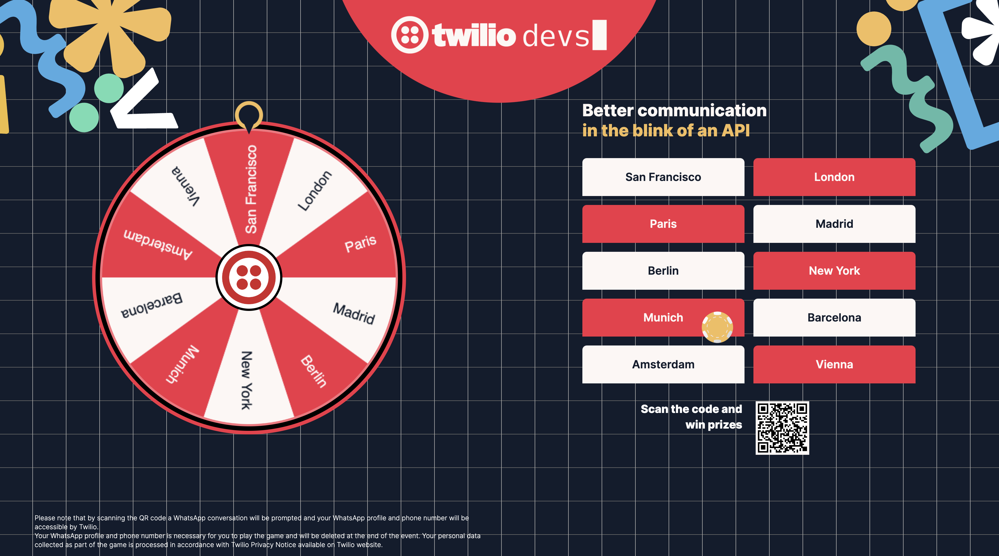

# Wheel Of Twilio Game

This project is Twilio's innovative booth activation designed to motivate people to engage with Twilio's technology while offering them the opportunity to win exciting prizes.



## Prerequisites

- Ensure you have [pnpm](https://pnpm.io/) installed.
- A Twilio account. Sign up [here](https://www.twilio.com/try-twilio) if you don't have one.

## Getting Started

1. **Clone the project repository:**

   ```bash
   git clone https://github.com/your-repo/twilio-activation-wheel.git
   cd twilio-activation-wheel
   ```

2. **Set up Twilio Services:**
   - Go to the [Twilio Console](https://www.twilio.com/console).
   - Create the following services and save the service SIDs:
     - A [Sync Service](https://twilio.com/console/sync).
     - A [Verify Service](https://twilio.com/console/verify) with the [Email channel enabled](https://www.twilio.com/docs/verify/email). You can use a template similar to the one in [resources/sendgridTemplate.html](resources/sendgridTemplate.html).
     - A [Messaging Service](https://twilio.com/console/messaging) with the correct WhatsApp sender configured. Also, ensure that the messaging service is configured to handle incoming SMS messages.
     - Add an SMS sender to the Twilio Messaging Service to support SMS messages.

3. **Configure Environment Variables:**
   - Rename `sample.env` to `.env.local`.
   - Add the required service SIDs and other variables in the `.env.local` file:

     ```env
     TWILIO_ACCOUNT_SID="ACxxxxx"
     TWILIO_API_KEY="SKxxxxx"
     TWILIO_API_SECRET="xxxxx"
     TWILIO_AUTH_TOKEN="xxxxx"
     EVENT_NAME="DevEvent 2024"
     NEXT_PUBLIC_WEDGES="San Francisco,London,Paris,Madrid,Berlin,New York,Munich,Barcelona,Amsterdam,Vienna"
     NEXT_PUBLIC_TWILIO_PHONE_NUMBER="+4918601860"
     MAX_BETS_PER_USER="0"
     VERIFY_SERVICE_SID="VAxxxxxxx"
     SYNC_SERVICE_SID="ISxxxxxx"
     BASIC_AUTH_USERNAME="twilio"
     BASIC_AUTH_PASSWORD="admin!"
     NEXT_PUBLIC_HIDE_QR_CODE=false
     NEXT_PUBLIC_PRIZES_PER_FIELD=5
     OFFERED_PRIZES="big"
     SMALL_PRIZES="Twilio Sticker Pack"
     LEAD_COLLECTION="MANUAL"
     ```

     > The flag `OFFERED_PRIZES` influences the message the winners get. If set the `small`, winners who bet on the right field are informed that they won and can collect a small prize at the Twilio booth. If set to `big`, they are notified that they qualified for a larger prize. You can also set the value to `both`, so winners can pick up a small prize and are qualified for the raffle prize at the same time.
     > The option `MAX_BETS_PER_USER` limits how often one user can submit a bet. If 0, the users can enter as many bets as they want.
     > With `SMALL_PRIZES`, you can list the small prizes that are available for the winners. If someone wins a small prize, it will be randomly selected from the list and tell the user what they won.
     > The flag `NEXT_PUBLIC_HIDE_QR_CODE` controls the visibility of QR code-related elements. When set to `true`, it hides the QR code, the "Scan the code and win prizes" text, the phone number display, and the QR code-related disclaimer. Defaults to `false` (shows all QR elements).
     > The option `NEXT_PUBLIC_PRIZES_PER_FIELD` sets the number of prizes available per wedge/field. When set to a positive number, fields will be styled differently when prizes run out, and users betting on fields without prizes will receive a different confirmation message. Set to `0` or omit for unlimited prizes.

4. **Run the setup script:**

   ```bash
   pnpm run setup
   ```

5. **Run ngrok**

   ```bash
   ngrok http 3000
   ```

   Copy the public URL and configure it as your WhatsApp / SMS webhook: `<URL>/api/incoming`.

6. **Start the application locally:**
   ```bash
   pnpm dev
   ```

After following these steps, the Wheel Of Twilio game should be up and running on your local machine. Enjoy testing and experimenting with Twilio's tech in a fun, interactive way!

If you encounter any issues or have questions, please refer to the issues section or open a new issue in the repository for assistance.

## Optional

## Optional Setup

### When Going on Breaks

The `/admin` page (basic-auth protected) has a Running / Paused / Ended segmented control in its header. Switching to `Paused` or `Ended` swaps the main wheel screen to a "be right back" / "game has ended" message and stops new bets from being accepted; switching back to `Running` resumes the game.

### Tips for production

Here are a few helpful notes:

- If you are using the SMS channel, make sure to [set the SMS Geo Permissions](https://www.twilio.com/docs/messaging/guides/sms-geo-permissions)to make sure senders from the entire world can interact with the Mixologist.
- Edit the [opt-out management settings](https://help.twilio.com/articles/360034798533-Getting-Started-with-Advanced-Opt-Out-for-Messaging-Services) of the messaging service to avoid that users accidentally unsubscribe from the list.
- Users can send the command "forget me" to remove all data stored about this user. It cancels pending orders, removes the user from the Sync data store and removes the Conversation resource. This can be used for debugging as well as to be GDPR-compliant.

### Lead Collection Mode

The registration flow is controlled by the `LEAD_COLLECTION` environment variable. It accepts one of three values:

| Value | Behaviour |
|-------|-----------|
| `MANUAL` (default) | Prompts the user for their name and email address, then verifies the email with Twilio Verify before allowing bets. |
| `NONE` | Skips registration entirely — any user can place a bet immediately. |
| `QR` | Asks the user to send a photo of their badge QR code. The code is decoded, the attendee profile is looked up, and a Twilio Customer Memory profile is created automatically. Requires `TWILIO_CONVERSATION_CONFIGURATION_ID`, `TWILIO_MEMORY_STORE_ID`, and `TWILIO_AUTH_TOKEN`. |

```env
LEAD_COLLECTION="MANUAL"
```

You can download the lead information by running the following script:

```bash
pnpm download
```

### Display Considerations

Monitor resolution may cause the wheel and fields to appear too small or too large, potentially overlapping with background graphics. To mitigate this, please use your browser's zoom functionality and view the landing page in full-screen mode for optimal display.

---

## Contributing

We welcome contributions! Please fork the repository

Here are some ideas for possible features to be added:

- Add Branded Calling so that conference attendees are not surprised by an unknown call (the winner notification)
